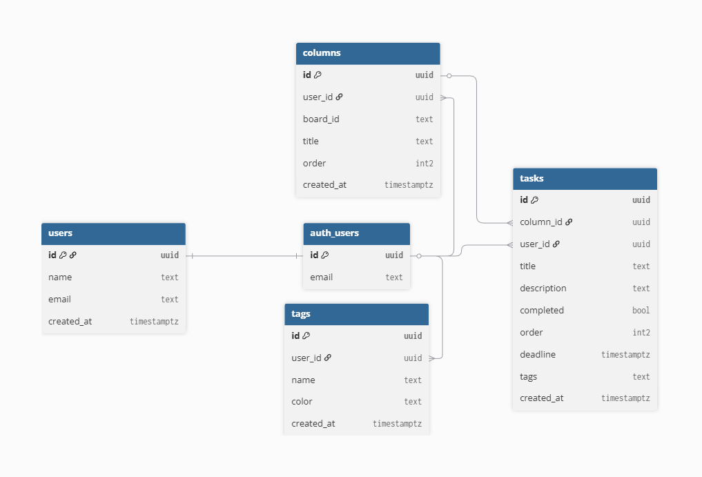

# 🚀 GetDone — Modern Kanban Productivity Suite

<p align="center">
  <b>Streamline your workflow. Master your time. Get things done.</b>
</p>

<p align="center">
  <a href="https://getdone.online">🌐 Live Demo</a> •
  <a href="https://github.com/alexkuznecov16/Task-Manager">📦 Repository</a>
</p>

---

## 🌟 Overview

**GetDone** is a modern, minimalist Kanban productivity app built for speed, clarity, and focus.

Designed with a **mobile‑first philosophy**, it delivers a seamless experience across desktop and mobile with real‑time synchronization and secure cloud storage.

Perfect for:

- Developers
- Students
- Freelancers
- Teams
- Anyone who wants to stay organized

---

## ✨ Features

- 🖱 Drag & drop tasks between columns
- 🔐 Secure authentication (Supabase Auth)
- ☁️ Real‑time cloud sync
- 📂 Kanban workflow management
- 🏷 Custom tags with colors
- ⚡ Fast and responsive UI
- 🎨 Modern clean interface
- 🛡 Secure database with Row‑Level Security
- 📱 Fully responsive design

---

## 🛠 Tech Stack

| Layer    | Technology      |
| -------- | --------------- |
| Frontend | React 18 + Vite |
| Backend  | Supabase        |
| Database | PostgreSQL      |
| Auth     | Supabase Auth   |
| Styling  | Modern CSS      |
| UX       | NProgress       |

---

## 🗄 Architecture

GetDone uses a secure and scalable architecture powered by Supabase and PostgreSQL.

Core concepts:

- Users own their own data
- Tasks belong to workflow columns
- Tags allow flexible organization
- Real‑time sync across devices
- Secure access via Row‑Level Security

See full schema diagram:



---

## 🚀 Getting Started

### Clone repository

```bash
git clone https://github.com/alexkuznecov16/Task-Manager.git
cd Task-Manager
```

### Install dependencies

```bash
npm install
```

### Setup environment

Create `.env` file:

```env
VITE_SUPABASE_URL=your_url
VITE_SUPABASE_KEY=your_key
```

### Run app

```bash
npm run dev
```

---

## 🌐 Live Demo

https://getdone.online

---

## 🤝 Contributing

Contributions are welcome.

If you'd like to improve GetDone:

- Fork the repository
- Create a feature branch
- Submit a Pull Request

---

## 📄 License

This project is open source and available under the MIT License.

---

## 👨‍💻 Author

Alexander Kuznecov

- Telegram: https://t.me/kznws111
- Email: alexander.kuznecov16@gmail.com

---

<p align="center">
  Built with passion for productivity.
</p>
